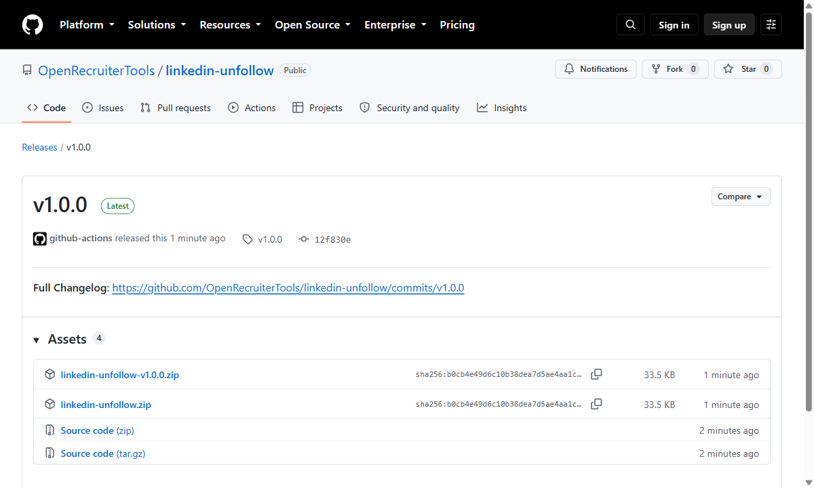
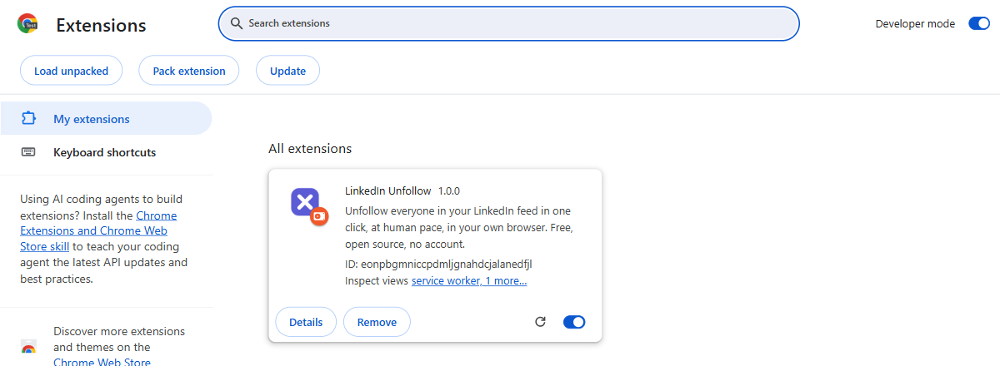
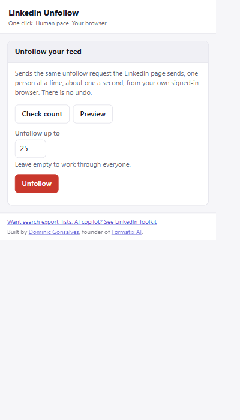

# LinkedIn Unfollow

**Tired of the AI slop in your LinkedIn feed? Unfollow everyone in one click.**

Unfollow everyone in your LinkedIn feed, at human pace, in your own browser.
Free, open source, no account, no server, no telemetry.

You stay connected to everyone — unfollowing is not disconnecting. You just stop
seeing their posts.

And because unfollowing everybody does not empty the feed — LinkedIn refills it
with what your network liked, commented on and reposted — **Quiet feed** hides
those in the page too. [See below](#quiet-feed-what-unfollowing-cannot-fix).

[**Download for Chrome →**](https://github.com/OpenRecruiterTools/linkedin-unfollow/releases/latest/download/linkedin-unfollow.zip)
(a 54 KB zip from the [latest release](https://github.com/OpenRecruiterTools/linkedin-unfollow/releases/latest)) ·
[Install guide with pictures](https://openrecruitertools.github.io/linkedin-unfollow/)

---

## Install it

Four steps, about two minutes. It is not on the Chrome Web Store — [see why](#why-it-is-not-in-the-chrome-web-store).

### 1. Download the zip

Take `linkedin-unfollow.zip` from the
[latest release](https://github.com/OpenRecruiterTools/linkedin-unfollow/releases/latest),
then unzip it **somewhere you will keep it**. Chrome loads the extension from
that folder every time it starts, so do not leave it in Downloads and then empty
Downloads.



### 2. Open `chrome://extensions` and turn on Developer mode

Type the address in by hand — it will not come up in search results. The switch
is in the top-right corner.


### 3. Click "Load unpacked" and pick the folder

Pick the folder *itself*, the one holding `manifest.json` — not a file inside it.



### 4. Pin the icon, sign in to LinkedIn, and click it

Click the jigsaw-piece icon, find LinkedIn Unfollow, click the pin. Then go to
[linkedin.com](https://www.linkedin.com/), sign in as normal, and click the icon.



---

## Use it

Three buttons and a number box. Work through them in order; do not skip to the
third one.

1. **Check count** — how many accounts you follow, and the first few names.
   Changes nothing.
2. **Preview** — the list of people it *would* unfollow, read by exactly the same
   call. Sends no unfollow at all.
3. **Unfollow** — set "Unfollow up to" to **1** first. Run it. Check that person
   really is unfollowed on LinkedIn. *Then* set it to 25, or 500, or clear the
   box to work through everyone.

Under the box are two tick boxes, both off to begin with: **also unfollow my
connections**, which is the one that actually silences the feed (see below), and
**fast**, which sends three at a time.

While it runs there is a progress line and a **Stop** button. Stop ends the run
after the person it is on.

---

## Connections are followed too

**Emptying the Following list to zero does not silence your feed.**

LinkedIn makes you follow everybody you connect with, and those connections
never appear on the "Following" page — which is the list LinkedIn shows you, and
the list this extension reads. Verified on a real account: with that list down to
0, the feed was still full of posts from connections.

The state is visible on your **followers** list instead, where every row comes
back with its own `following: true` or `false`. That is what the tick box under
"Unfollow up to" turns on:

> **Also unfollow my connections (scans your followers list; slower)**

With it ticked, a run works through the Following list exactly as before, and
then reads your followers list fifty at a time and unfollows the ones still
marked as followed. Nobody is disconnected: you stay connected, you just stop
seeing the posts.

It is slower because it is far more reading. 9,479 followers is 190 requests
before a single unfollow is sent, so "Check count" with the box ticked takes a
couple of minutes, and the progress line reads "Scanning followers… N of M"
while it works.

---

## Quiet feed: what unfollowing cannot fix

**Unfollow everybody and the feed does not go quiet — it refills.**

Unfollowing removes what you subscribed to, and nothing else. LinkedIn then
fills the space with what the people you are still *connected* to have been
doing — the posts they liked, commented on and reposted, the people they follow
— plus its own suggestions and its ads. Quiet feed hides all of that in the
page, so what is left is the people you chose to follow.

Verified on a real account the day after unfollowing everyone: with the
Following list at zero, every post on the home feed carried a header line above
the author saying why it was there.

| Header on the post | What it is |
|---|---|
| "Priya likes this", "celebrates", "loves", "finds this insightful" | somebody's reaction |
| "Priya commented", "Priya and 3 others commented" | somebody's comment |
| "Priya reposted this" | somebody's repost |
| "Followed by Priya" | somebody a connection follows |
| "Priya was mentioned…", "Northwind is hiring" | other activity |
| "Suggested" | LinkedIn's recommendation |
| "Promoted" | an ad |
| *no header at all* | **somebody you follow — this is what stays** |

That header is all it goes on. LinkedIn's markup has no stable class names —
they are obfuscated on every build — so the classifier reads the rendered text
of each post, takes the line above the author block, and matches it against the
list above. Everything else is left alone, and "left alone" is the default in
every unclear case: a post with no author block is not a post as far as this is
concerned (that is the composer, the draft box, the "Start a post" card), and a
header form it has not been taught falls through to *shown*. It hides only what
it positively recognised.

Turn it on and off in the popup, in the card above the unfollow one: a master
switch, and three tick boxes for network activity, promoted and suggested. All
four are on to begin with. At the top of the feed a single grey line says what
it did — "Quiet feed: hid 23 posts (18 from your network's activity, 3 promoted,
2 suggested). Show them" — and **Show them** puts every one of them back for
that page load.

Nothing is deleted, nothing is sent. It adds one CSS class to posts already in
your browser; no request is made, LinkedIn is not told, and the count in the
popup is a number in `chrome.storage.local` on your own machine.

---

## How it works

It makes the same requests linkedin.com's own pages make, from your own
signed-in browser:

| | |
|---|---|
| **List** | `GET /voyager/api/graphql?…MYNETWORK_CURATION_HUB…PEOPLE_FOLLOW…` — the total comes straight from LinkedIn's `totalResultCount`, so "you follow 735 people" is the real number, not a count of rows on screen. |
| **Followers list** | `GET /voyager/api/graphql?…MYNETWORK_CURATION_HUB…FOLLOWERS…` — the same query with `resultType FOLLOWERS`, fifty rows at a time. Read only when "also unfollow my connections" is ticked. Each row comes back with its own following state, which is the only place your connections' state appears. |
| **Unfollow** | `POST /voyager/api/feed/dash/followingStates/urn:li:fsd_followingState:urn:li:fsd_profile:<id>` with `{"patch":{"$set":{"following":false}}}` — one person, one request. |

Around those calls:

- **Paced like a human.** One person every 0.8–1.6 seconds, randomised, one
  request at a time. Never a burst.
- **Stops on any LinkedIn challenge.** 429, 451, 401 and 403 end the run on the
  spot, and so do two non-200s in a row. Nothing is ever retried.
- **You can stop it.** Stop takes effect after the person it is on, so you are
  never left wondering whether the last one landed.
- **Never more than you asked for.** The limit is enforced in the engine, and one
  run will not do more than 5,000 whatever you type.
- **Nothing leaves your browser.** No account, no server, no analytics, no
  telemetry, no third-party requests of any kind. The only host it talks to is
  `www.linkedin.com`, with your own cookies. Read `src/` — it is about 1,800 lines
  and there is no build step, so what you install is what you can read.
- **Nothing is bypassed.** The CSRF token is your own `JSESSIONID` cookie, read
  through Chrome's `cookies` API. No security measure is defeated, worked around
  or forged; if you are not signed in, it simply fails.

**Fast mode.** Ticking "Fast (3 at a time — more likely to trip LinkedIn's rate
limit)" runs three streams over the same list instead of one, each leaving
0.5–0.9 seconds between its own requests: roughly four unfollows a second rather
than one. The three share one cursor, one list of people already handled and one
pool of limit slots, so they cannot between them overshoot the limit you typed
or send anyone twice, and a 429, 403 or 401 on any one of them ends the run for
all three — Stop and the progress line work across them as usual. Careful, one
at a time, is the default, and it is the one to use: fast is several times
quicker and correspondingly more likely to be the thing LinkedIn notices.

If LinkedIn rotates the hashed query id the list call depends on, there is a
second engine that clicks the Following page instead, exactly as a person would.
See [docs/fallback.md](docs/fallback.md).

---

## FAQ

**Is this against LinkedIn's terms?**
Yes — automating your account is. LinkedIn's User Agreement prohibits using
"bots or other automated methods" to access the service, and LinkedIn restricts
and permanently bans accounts for it. This tool does not pretend otherwise. Use
it on your own account, with your eyes open, or do not use it.

**Does it bypass any security measure?**
No. It sends the requests the page itself sends, signed with your own session
cookie, at a fraction of the rate a person clicking could manage. It does not
defeat rate limits, solve challenges, rotate identities, or touch anyone else's
account — and when LinkedIn puts up a challenge it stops rather than working
around it.

**It said 0 following but I still see posts from connections.**
That is what the "also unfollow my connections" tick box is for. Connections are
followed automatically when you connect and never appear in LinkedIn's Following
list, so emptying that list leaves every one of them behind. Tick the box and run
it again — it reads your followers list, where their state actually shows up.

**I unfollowed everyone and my feed is still full.**
It will be. Unfollowing only empties the list of people whose posts you
subscribed to; LinkedIn immediately refills the feed with what your connections
liked, commented on and reposted, plus suggestions and ads. That is what Quiet
feed is for — it hides them in the page, and it is on by default.

**Does Quiet feed send anything to LinkedIn?**
No. It reads the text of the posts already on screen and adds a CSS class to the
ones it recognises. No request is made, nothing is deleted, and pressing "Show
them" at the top of the feed puts them all back.

**Will I lose my connections?**
No. Unfollowing is not disconnecting. Your connections stay connections; you
just stop seeing their posts. You can follow anyone again by hand.

**Can I undo it?**
No. Not in bulk. Unfollowing 800 people would have to be reversed 800 times by
hand. This is why "Preview" and a limit of 1 exist — use them.

**How long does 800 people take?**
Roughly fifteen minutes. The popup can be closed while it runs.

**Does it work on Edge, Brave, Arc?**
It is a standard MV3 extension, so any Chromium browser that can load an unpacked
extension should run it. Only Chrome is tested.

**Do you see any of my data?**
No. There is nothing to see it with: no account, no backend, no analytics.

---

## Disclaimer

**Read this before you install it.**

Automating your LinkedIn account may breach LinkedIn's User Agreement. LinkedIn
detects automation and restricts, suspends and permanently bans accounts for it,
including accounts that have done nothing else wrong. **That risk is entirely
yours.** The pacing and the stop conditions in this extension reduce it; nothing
removes it.

This software is provided as is, without warranty of any kind. The author is not
responsible for any restriction, suspension or loss of your LinkedIn account, for
any people you unfollow and cannot get back, or for any other consequence of
running it. It performs an irreversible bulk action on your own account: preview
first, try one, and never run it against an account you cannot afford to lose.

It is for your own account only. Do not use it on an account you do not own or
have not been asked to operate.

---

## Why it is not in the Chrome Web Store

Store policy forbids extensions that facilitate breaking another site's terms of
service, and an honest reading of LinkedIn's terms puts automating your own
account in that territory. Loading it unpacked keeps the decision — and the code
you are running, which you can read — with you.

---

## Development

```bash
npm install
npm test      # vitest, with an in-memory chrome mock — nothing touches LinkedIn
npm run lint  # eslint
npm run zip   # dist/linkedin-unfollow-v1.2.0.zip
```

There is no build step. `src/` is what ships.

| Path | What it is |
|---|---|
| `src/linkedin.js` | The three API calls, and the parsers for the two list responses. |
| `src/background.js` | The engine: two sources, one to three streams, pacing, limits, stop conditions, message router. |
| `src/dom-fallback.js` | The click-the-page engine, kept for when the query id rotates. |
| `src/content/classify.js` | Quiet feed's classifier: a post's text in, a category out. Pure — no DOM, no `chrome`. |
| `src/content/quiet-feed.js` | The content script: find the posts, hide the ones the tick boxes name, draw the line at the top. |
| `src/content/boot.js` | Three lines, because MV3 will not load a module as a content script. |
| `src/popup/` | The one screen. |
| `tests/` | 193 tests. Every fixture is invented; no real person appears in them. |

---

## Credits

Built by [Dominic Gonsalves](https://www.linkedin.com/in/dominic-g-6a9a5680/),
founder of [Formatix AI](https://formatix.ai) —
GitHub [@FormatixAI](https://github.com/FormatixAI).

Want search export, saved lists, an AI copilot and 30-odd other things on
LinkedIn? That is the bigger project this was carved out of:
[**LinkedIn Toolkit**](https://github.com/OpenRecruiterTools/linkedin-toolkit).

MIT licensed. See [LICENSE](LICENSE).
